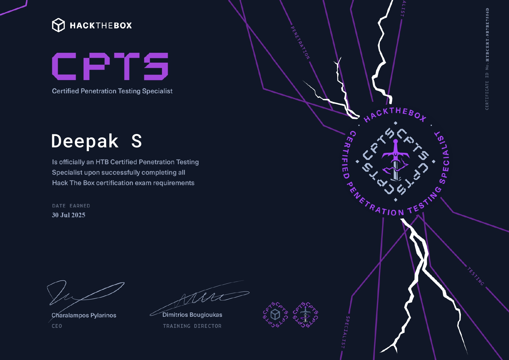
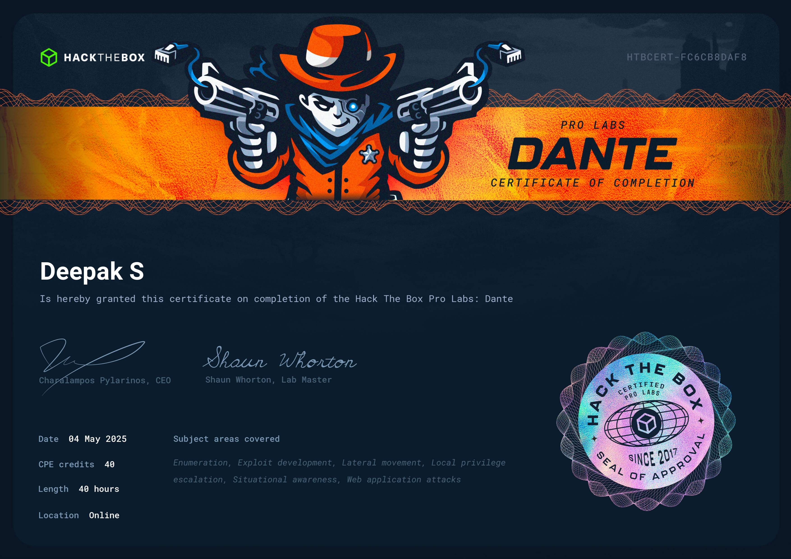
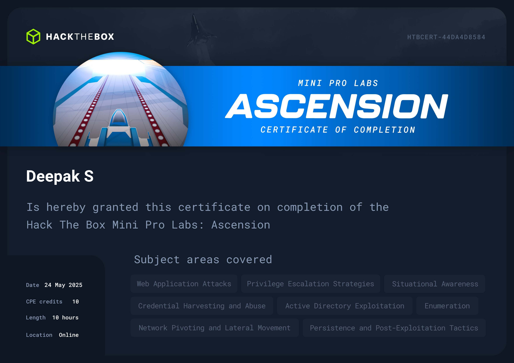
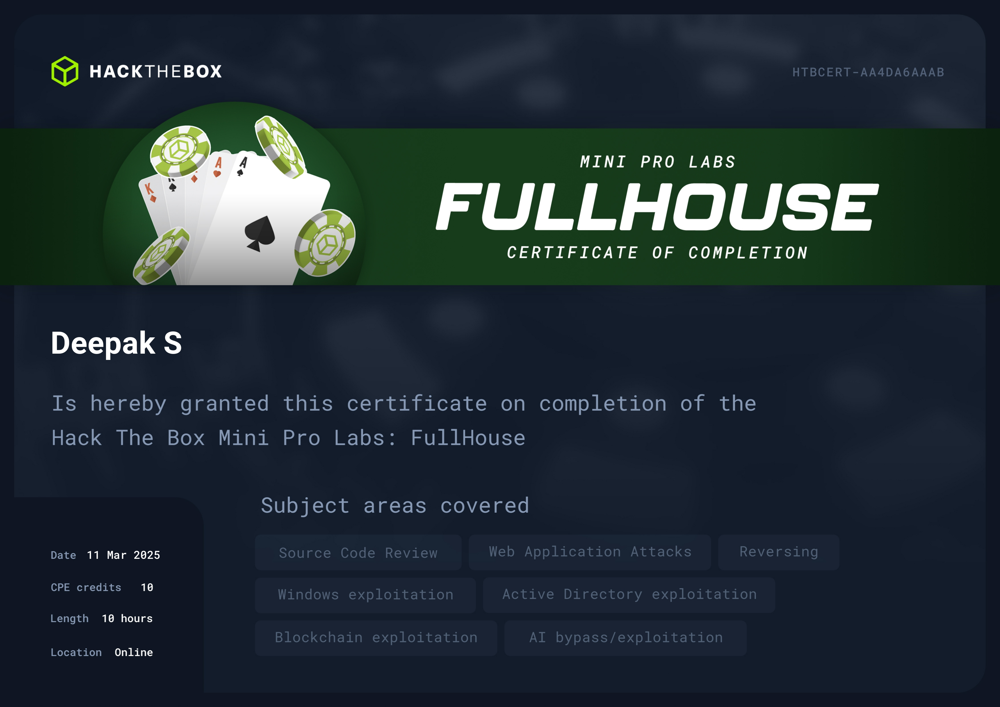
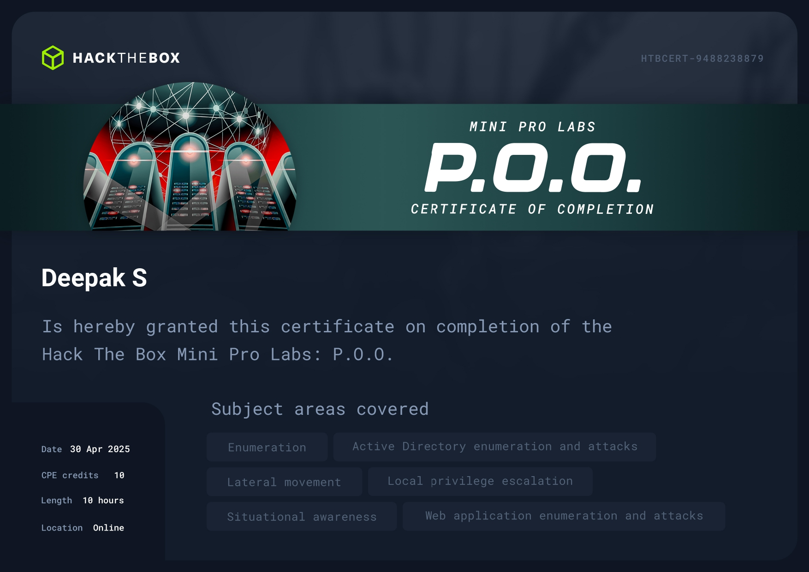
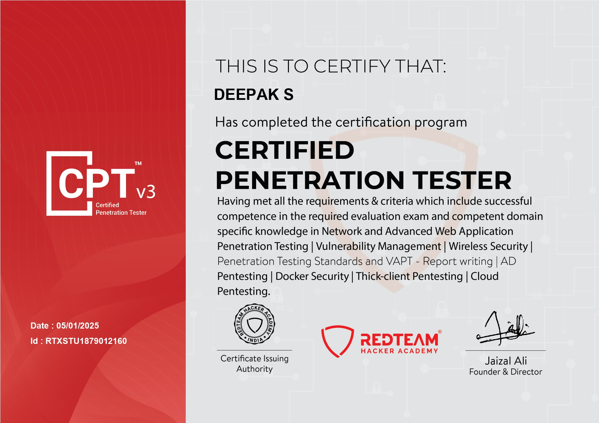
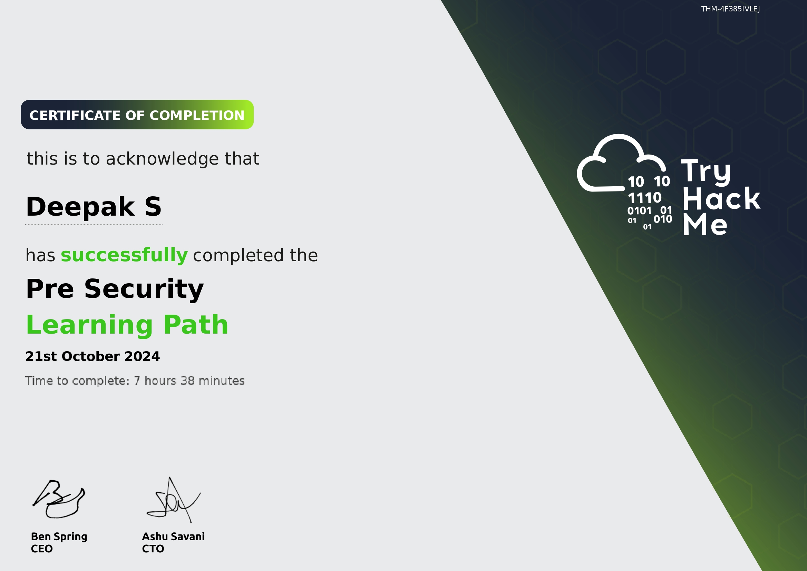
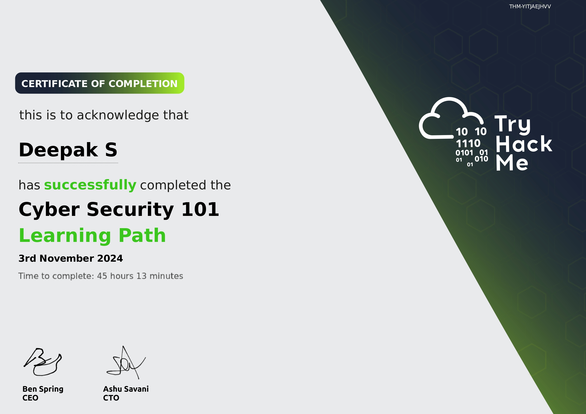
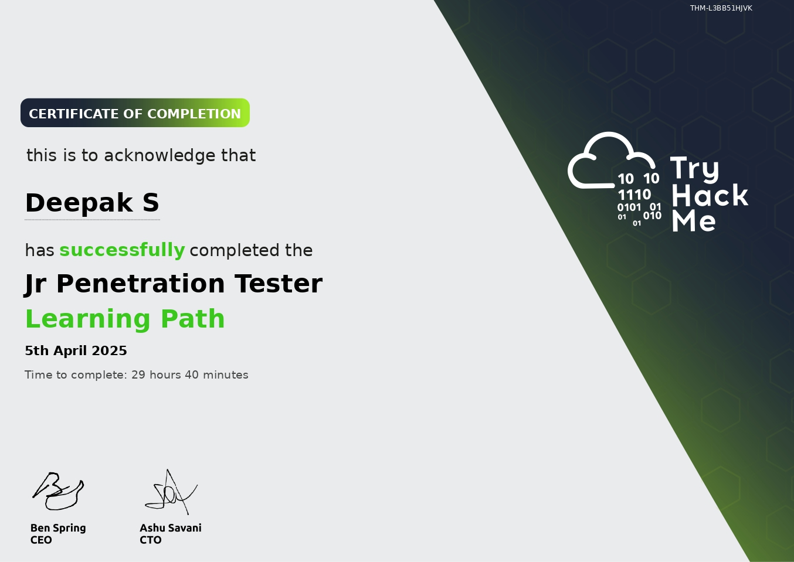
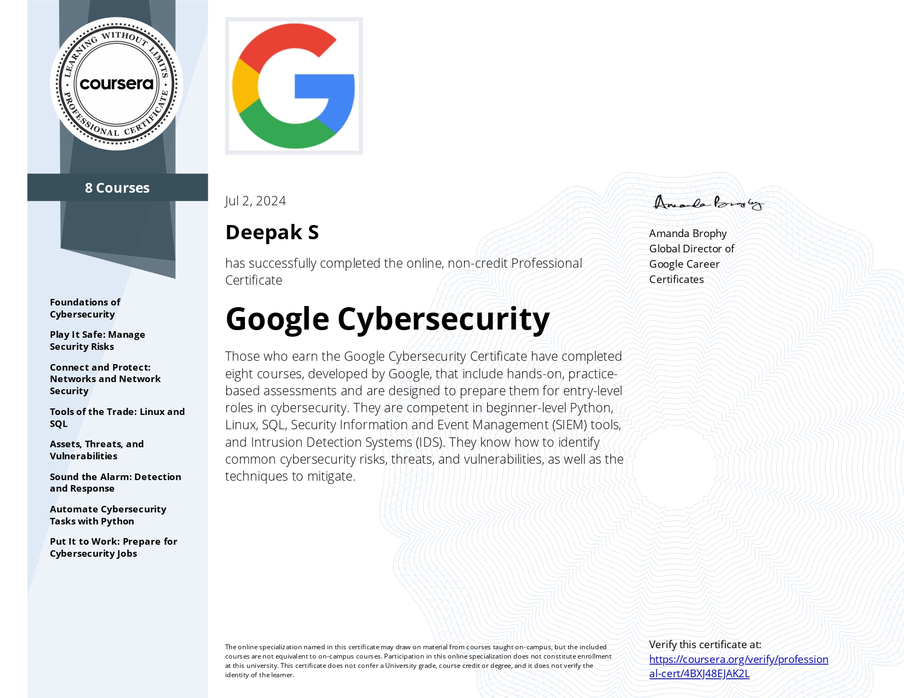

# 🎓 Certifications & Practical Labs

Below is a comprehensive list of certifications and hands-on labs I’ve completed as part of my professional growth.

---

## Hack The Box

**HTB Certified Penetration Testing Specialist (HTB CPTS)**  

**Dante Pro Lab**  

**Ascension – Mini Pro Lab**  

**FullHouse – Mini Pro Lab**  

**P.O.O – Mini Pro Lab**  

---

## Red Team Hacker Academy

**Certified Penetration Tester (CPTS)**  

---

##  TryHackMe

**Pre Security**  

**Cybersecurity 101**  

**Web Fundamentals**  

**Jr Penetration Tester**  

---

##  Google

**Google Cybersecurity Certificate**  

---

> *These images represent my completed training and verified accomplishments.*
